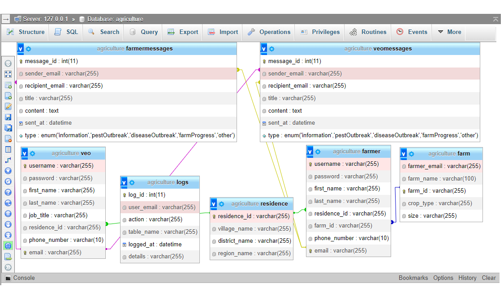

<!-- Improved compatibility of back-to-top link: See: https://github.com/othneildrew/Best-README-Template/pull/73 -->
<a name="readme-top"></a>


<!-- PROJECT SHIELDS -->

[![Contributors][contributors-shield]][contributors-url]
[![Forks][forks-shield]][forks-url]
[![Stargazers][stars-shield]][stars-url]
[![Issues][issues-shield]][issues-url]
[![MIT License][license-shield]][license-url]
[![LinkedIn][linkedin-shield]][linkedin-url]


<!-- PROJECT LOGO -->
<br />
<div align="center">

  <h3 align="center">Agriculture system database</h3>

  <p align="center">
    The system aims to facilitate effective communication between Village Extension Officers (VEOs) and farmers in the Tanzanian agriculture system
    <br />
    <a href="https://github.com/slymackjr/E-commerce-Home-Page-Project-Test-1"><strong>Explore the docs »</strong></a>
    <br />
    <br />
    <a href="https://github.com/slymackjr/E-commerce-Home-Page-Project-Test-1/issues">Report Bug</a>
    ·
    <a href="https://github.com/slymackjr/E-commerce-Home-Page-Project-Test-1/issues">Request Feature</a>
  </p>
</div>


<!-- TABLE OF CONTENTS -->
<details>
  <summary>Table of Contents</summary>
  <ol>
    <li>
      <a href="#about-the-project">About The Project</a>
      <ul>
        <li><a href="#built-with">Built With</a></li>
      </ul>
    </li>
    <li>
      <a href="#getting-started">Getting Started</a>
      <ul>
        <li><a href="#prerequisites">Prerequisites</a></li>
        <li><a href="#installation">Installation</a></li>
      </ul>
    </li>
    <li><a href="#database-creation">Database Creation</a></li>
    <li><a href="#usage">Usage</a></li>
    <li><a href="#roadmap">Roadmap</a></li>
    <li><a href="#contributing">Contributing</a></li>
    <li><a href="#license">License</a></li>
    <li><a href="#contact">Contact</a></li>
    <li><a href="#acknowledgments">Acknowledgments</a></li>
  </ol>
</details>


<!-- ABOUT THE PROJECT -->
## About The Project

[![Product Name Screen Shot][product-screenshot]](https://example.com)

The system aims to facilitate effective communication between Village Extension Officers (VEOs) and farmers in the Tanzanian agriculture system. Key functionalities include informing farmers about disease outbreaks, and pest attacks, and disseminating information on new farming technologies. The system supports two-way communication between VEOs and farmers.

Also, the database system is designed to streamline communication between farmers and VEOs in Tanzania's agricultural landscape. The system comprises tables representing entities such as farmers, VEOs, farms, messages, and logs. The key entities and their relationships are illustrated through Entity-Relationship (ER) diagrams. The tables are connected through foreign key constraints, ensuring data integrity and consistency.

<p align="right">(<a href="#readme-top">back to top</a>)</p>


### Built With

* [![SQL Version][SQL-shield]][SQL-url]


<p align="right">(<a href="#readme-top">back to top</a>)</p>


<!-- GETTING STARTED -->
## Getting Started

This is an example of how you may give instructions on setting up your project locally. To get a local copy up and running, follow these simple steps.
### Prerequisites

* MySQL server or any other SQL database system which support procedures, functions and triggers across the database development.

### Installation

1. Clone the repo
   ```sh
   git clone https://github.com/slymackjr/agriculture-database.git
   ```

<p align="right">(<a href="#readme-top">back to top</a>)</p>

## Database Creation

### Steps
1. Connect to your MySQL server.
2. Create the `agriculture` database.
  ```sh
      CREATE DATABASE agriculture;
  ```
3. Switch to the `agriculture` database.
  ```sh
      USE agriculture;
  ```      
4. Create required tables for the database system in an order that referential integrity is not affected.
 #### Residence table.
  ```sh
      CREATE TABLE Residence (
      residence_id VARCHAR(255) PRIMARY KEY,
      village_name VARCHAR(255) NOT NULL,
      district_name VARCHAR(255) NOT NULL,
      region_name VARCHAR(255) NOT NULL
  );
  ```
  #### Farm table
  ```sh
      CREATE TABLE Farm (
      farmer_email VARCHAR(255) NOT NULL,
      farm_name VARCHAR(100) NOT NULL,
      farm_id VARCHAR(255) PRIMARY KEY,
      crop_type VARCHAR(255),
      size VARCHAR(255) NOT NULL
  );
  ```
  #### VEO table
  ```sh
      CREATE TABLE Veo (
      username VARCHAR(255) UNIQUE NOT NULL,
      password VARCHAR(255) NOT NULL,
      first_name VARCHAR(255),
      last_name VARCHAR(255),
      job_title VARCHAR(255),
      residence_id VARCHAR(255),
      phone_number VARCHAR(10),
      email VARCHAR(255) PRIMARY KEY,
      FOREIGN KEY (residence_id) REFERENCES Residence(residence_id)
  );
  ```
  #### Farmer table
  ```sh
      CREATE TABLE Farmer (
      username VARCHAR(255) UNIQUE NOT NULL,
      password VARCHAR(255) NOT NULL,
      first_name VARCHAR(255),
      last_name VARCHAR(255),
      residence_id VARCHAR(255),
      farm_id VARCHAR(255),
      phone_number VARCHAR(10),
      email VARCHAR(255) PRIMARY KEY,
      FOREIGN KEY (residence_id) REFERENCES Residence(residence_id),
      FOREIGN KEY (farm_id) REFERENCES Farm(farm_id)
  );
  ```
  #### FarmerMessages table
  ```sh
      CREATE TABLE FarmerMessages (
      message_id INT PRIMARY KEY AUTO_INCREMENT,
      sender_email VARCHAR(255),
      recipient_email VARCHAR(255),
      title VARCHAR(255) NOT NULL,
      content TEXT NOT NULL,
      sent_at DATETIME NOT NULL DEFAULT CURRENT_TIMESTAMP,
      type ENUM('information', 'pestOutbreak', 'diseaseOutbreak', 'farmProgress', 'other') NOT NULL,
      FOREIGN KEY (sender_email) REFERENCES Farmer(email),
      FOREIGN KEY (recipient_email) REFERENCES Veo(email)
  );
  ```
  #### VeoMessages table
  ```sh
      CREATE TABLE VeoMessages (
      message_id INT PRIMARY KEY AUTO_INCREMENT,
      sender_email VARCHAR(255),
      recipient_email VARCHAR(255),
      title VARCHAR(255) NOT NULL,
      content TEXT NOT NULL,
      sent_at DATETIME NOT NULL DEFAULT CURRENT_TIMESTAMP,
      type ENUM('information', 'pestOutbreak', 'diseaseOutbreak', 'farmProgress', 'other') NOT NULL,
      FOREIGN KEY (sender_email) REFERENCES Veo(email),
      FOREIGN KEY (recipient_email) REFERENCES Farmer(email)
  );
  ```
  #### Logs table
  ```sh
      CREATE TABLE Logs (
      log_id INT PRIMARY KEY AUTO_INCREMENT,
      user_email VARCHAR(255),
      action VARCHAR(255) NOT NULL,
      table_name VARCHAR(255),
      logged_at DATETIME NOT NULL DEFAULT CURRENT_TIMESTAMP,
      details VARCHAR(255)
  );
  ```
  #### Triggers for logging information when insertion happens
  ```sh
      DELIMITER //

      CREATE TRIGGER LogInsertFarmerMessages
      AFTER INSERT ON FarmerMessages
      FOR EACH ROW
      BEGIN
        INSERT INTO Logs (user_email,action,table_name,logged_at,details)
        VALUES (NEW.sender_email, 'SENT MESSAGE', 'FarmerMessages', NOW(), CONCAT('Farmer Messaged Veo: ', NEW.recipient_email));
      END//

      CREATE TRIGGER LogInsertVeoMessages
      AFTER INSERT ON VeoMessages
      FOR EACH ROW
      BEGIN  INSERT INTO Logs (user_email,action,table_name,logged_at,details)
        VALUES (NEW.sender_email, 'SENT MESSAGE', 'VeoMessages', NOW(), CONCAT('Veo Messaged Farmer: ', NEW.recipient_email));
      END//

      CREATE TRIGGER LogInsertFarmer
      AFTER INSERT ON Farmer
      FOR EACH ROW
      BEGIN
        INSERT INTO Logs (user_email,action,table_name,logged_at,details)
        VALUES (NEW.email, 'REGISTER', 'Farmer', NOW(), CONCAT('New Farmer Registered: ', NEW.username));
      END//

      CREATE TRIGGER LogInsertVeo
      AFTER INSERT ON Veo
      FOR EACH ROW
      BEGIN
        INSERT INTO Logs (user_email,action,table_name,logged_at,details)
        VALUES (NEW.email, 'REGISTER', 'Veo', NOW(), CONCAT('New Veo Registered: ', NEW.username));
      END//

      CREATE TRIGGER LogInsertFarm
      AFTER INSERT ON farm
      FOR EACH ROW
      BEGIN
          INSERT INTO Logs (user_email, action, table_name, logged_at, details)
          VALUES (NEW.farmer_email, 'INSERT FARM', 'Farm', NOW(), CONCAT('New Farm Inserted: ', NEW.farm_id));
      END//

      DELIMITER ;
  ```
  #### Trigger for logging information when updating happens
  ```sh
      DELIMITER //

      CREATE TRIGGER LogUpdateFarmerMessages
      AFTER UPDATE ON FarmerMessages
      FOR EACH ROW
      BEGIN
        INSERT INTO Logs (user_email,action,table_name,logged_at,details)
        VALUES (NEW.sender_email, 'UPDATE MESSAGE', 'FarmerMessages', NOW(), CONCAT('Farmer Message Updated for: ', NEW.recipient_email));
      END//

      CREATE TRIGGER LogUpdateVeoMessages
      AFTER UPDATE ON VeoMessages
      FOR EACH ROW
      BEGIN
        INSERT INTO Logs (user_email,action,table_name,logged_at,details)
        VALUES (NEW.sender_email, 'UPDATE MESSAGE', 'VeoMessages', NOW(), CONCAT('Veo Message Updated for: ', NEW.recipient_email));
      END//

      CREATE TRIGGER LogUpdateFarmer
      AFTER UPDATE ON Farmer
      FOR EACH ROW
      BEGIN
        INSERT INTO Logs (user_email,action,table_name,logged_at,details)
        VALUES (NEW.email, 'UPDATE PROFILE', 'Farmer', NOW(), CONCAT('Farmer Update their Info: ', NEW.username));
      END//

      CREATE TRIGGER LogUpdateVeo
      AFTER UPDATE ON Veo
      FOR EACH ROW
      BEGIN
        INSERT INTO Logs (user_email,action,table_name,logged_at,details)
        VALUES (NEW.email, 'UPDATE PROFILE', 'Veo', NOW(), CONCAT('Veo Update their Info: ', NEW.username));
      END//

      CREATE TRIGGER LogUpdateFarm
      AFTER UPDATE ON farm
      FOR EACH ROW
      BEGIN
          INSERT INTO Logs (user_email, action, table_name, logged_at, details)
          VALUES (NEW.farmer_email, 'UPDATE FARM', 'Farm', NOW(), CONCAT('Farm Updated: ', NEW.farm_id));
      END//

      DELIMITER ;
  ```
  #### Triggers for logging deletes
  ```sh
      DELIMITER //

      CREATE TRIGGER LogDeleteFarmerMessages
      BEFORE DELETE ON FarmerMessages
      FOR EACH ROW
      BEGIN
        INSERT INTO Logs (user_email,action,table_name,logged_at,details)
        VALUES (OLD.sender_email, 'DELETE MESSAGE', 'FarmerMessages', NOW(), CONCAT('Farmer Deleted Message to: ', OLD.recipient_email));
      END//

      CREATE TRIGGER LogDeleteVeoMessages
      BEFORE DELETE ON VeoMessages
      FOR EACH ROW
      BEGIN
        INSERT INTO Logs (user_email,action,table_name,logged_at,details)
        VALUES (OLD.sender_email, 'DELETE MESSAGE', 'VeoMessages', NOW(), CONCAT('Veo Deleted Message to: ', OLD.recipient_email));
      END//

      CREATE TRIGGER LogDeleteFarmer
      BEFORE DELETE ON Farmer
      FOR EACH ROW
      BEGIN
        INSERT INTO Logs (user_email,action,table_name,logged_at,details)
        VALUES (OLD.email, 'DELETE ACCOUNT', 'Farmer', NOW(), CONCAT('Farmer Deleted Account: ', OLD.username));
      END//

      CREATE TRIGGER LogDeleteVeo
      BEFORE DELETE ON Veo
      FOR EACH ROW
      BEGIN
        INSERT INTO Logs (user_email,action,table_name,logged_at,details)
        VALUES (OLD.email, 'DELETE ACCOUNT', 'Veo', NOW(), CONCAT('Veo Deleted Account: ', OLD.username));
      END//

      CREATE TRIGGER LogDeleteFarm
      BEFORE DELETE ON farm
      FOR EACH ROW
      BEGIN
          INSERT INTO Logs (user_email, action, table_name, logged_at, details)
          VALUES (OLD.farmer_email, 'DELETE FARM', 'Farm', NOW(), CONCAT('Farm Deleted: ', OLD.farm_id));
      END//

      DELIMITER ;
  ```
  #### function to validate user authentication
  ```sh
      DELIMITER //
      CREATE FUNCTION ValidatePasswordFarmer(email VARCHAR(255), password VARCHAR(255))
      RETURNS BOOLEAN
      BEGIN
          DECLARE stored_hash CHAR(64);
          SELECT password INTO stored_hash FROM Farmer WHERE email = email;
          RETURN stored_hash = SHA2(password, 512);
      END //

      CREATE FUNCTION ValidatePasswordVeo(email VARCHAR(255), password VARCHAR(255))
      RETURNS BOOLEAN
      BEGIN
          DECLARE stored_hash CHAR(64);
          SELECT password INTO stored_hash FROM Veo WHERE email = email;
          RETURN stored_hash = SHA2(password, 512);
      END //
      DELIMITER ;
  ```
  #### Stored procedure for user authentication
  ```sh
      DELIMITER $$
      CREATE PROCEDURE AuthenticateFarmer(
        IN p_email VARCHAR(255),
        IN p_password VARCHAR(255),
        OUT is_authenticated BOOLEAN
      )
      BEGIN
          IF ValidatePasswordFarmer(p_email, p_password) THEN  
            SET is_authenticated = TRUE;
          END IF;
          IF is_authenticated IS NULL THEN
              SET is_authenticated = FALSE;
        END IF;
      END $$

      CREATE PROCEDURE AuthenticateVeo(
        IN p_email VARCHAR(255),
        IN p_password VARCHAR(255),
        OUT is_authenticated BOOLEAN
      )
      BEGIN
          IF ValidatePasswordVeo(p_email, p_password) THEN  
            SET is_authenticated = TRUE;
          END IF;
          IF is_authenticated IS NULL THEN
              SET is_authenticated = FALSE;
        END IF;
      END $$

      DELIMITER ;
  ```
  #### Stored procedure for data insertion
  ```sh
      DELIMITER //

      CREATE PROCEDURE InsertFarmer(
          IN p_username VARCHAR(255),
          IN p_password VARCHAR(255),
          IN p_first_name VARCHAR(255),
          IN p_last_name VARCHAR(255),
          IN p_residence_id VARCHAR(255),
          IN p_farm_id VARCHAR(255),    
          IN p_phone_number VARCHAR(20),
          IN p_email VARCHAR(255)
      )
      BEGIN
          DECLARE hashed_password CHAR(64);
          SET hashed_password = SHA2(p_password, 512);

          INSERT INTO Farmer (farm_id, username, password, first_name, last_name, residence_id, phone_number, email)
          VALUES (p_farm_id, p_username, hashed_password, p_first_name, p_last_name, p_residence_id, p_phone_number, p_email);
      END//

      CREATE PROCEDURE InsertVeo(
          IN p_username VARCHAR(255),
          IN p_password VARCHAR(255),
          IN p_first_name VARCHAR(255),
          IN p_last_name VARCHAR(255),
          IN p_job_title VARCHAR(255),    
          IN p_residence_id VARCHAR(255),    
          IN p_phone_number VARCHAR(20),
          IN p_email VARCHAR(255)
      )
      BEGIN
          DECLARE hashed_password CHAR(64);
          SET hashed_password = SHA2(p_password, 512);

          INSERT INTO Veo (username, password, first_name, last_name, job_title, residence_id, phone_number, email)
          VALUES (p_username, hashed_password, p_first_name, p_last_name, p_job_title, p_residence_id, p_phone_number, p_email);
      END//


      CREATE PROCEDURE InsertFarm (
          IN `p_farmer_email` VARCHAR(255),
          IN `p_farm_name` VARCHAR(100),
          IN `p_farm_id` VARCHAR(255),
          IN `p_crop_type` VARCHAR(255),
          IN `p_size` VARCHAR(255)
      )
      BEGIN
          INSERT INTO farm (farmer_email, farm_name, farm_id, crop_type, size)
          VALUES (p_farmer_email, p_farm_name, p_farm_id, p_crop_type, p_size);
      END//


      CREATE PROCEDURE InsertFarmerMessage(
          IN p_sender_email VARCHAR(255),
          IN p_recipient_email VARCHAR(255),
          IN p_title VARCHAR(255),
          IN p_content TEXT,
          IN p_type ENUM('information', 'pestOutbreak', 'diseaseOutbreak', 'farmProgress', 'other')
      )
      BEGIN
          INSERT INTO FarmerMessages (sender_email, recipient_email, title, content, type)
          VALUES (p_sender_email, p_recipient_email, p_title, p_content, p_type);
      END//
      CREATE PROCEDURE InsertVeoMessage(
          IN p_sender_email VARCHAR(255),
          IN p_recipient_email VARCHAR(255),
          IN p_title VARCHAR(255),
          IN p_content TEXT,
          IN p_type ENUM('information', 'pestOutbreak', 'diseaseOutbreak', 'farmProgress', 'other')
      )
      BEGIN
          INSERT INTO VeoMessages (sender_email, recipient_email, title, content, type)
          VALUES (p_sender_email, p_recipient_email, p_title, p_content, p_type);
      END//

      DELIMITER ;
  ```
  #### Stored procedure for data updates
  ```sh
      DELIMITER //

      CREATE PROCEDURE UpdateFarmer (
          IN `p_email` VARCHAR(255),
          IN `p_new_first_name` VARCHAR(255),
          IN `p_new_last_name` VARCHAR(255),
          IN `p_new_residence_id` VARCHAR(255),
          IN `p_new_farm_id` VARCHAR(255),
          IN `p_new_phone_number` VARCHAR(20)
      )
      BEGIN
          -- Updating Farmer Information
          UPDATE farmer
          SET 
              first_name = IFNULL(p_new_first_name, first_name),
              last_name = IFNULL(p_new_last_name, last_name),
              residence_id = IFNULL(p_new_residence_id, residence_id),
              farm_id = IFNULL(p_new_farm_id, farm_id),
              phone_number = IFNULL(p_new_phone_number, phone_number)
          WHERE email = p_email;
      END//

      -- Procedure to Update Veo Information
      CREATE PROCEDURE UpdateVeo (
          IN `p_email` VARCHAR(255),
          IN `p_new_first_name` VARCHAR(255),
          IN `p_new_last_name` VARCHAR(255),
          IN `p_new_job_title` VARCHAR(255),
          IN `p_new_residence_id` VARCHAR(255),
          IN `p_new_phone_number` VARCHAR(20)
      )
      BEGIN
          -- Updating Veo Information
          UPDATE veo
          SET 
              first_name = IFNULL(p_new_first_name, first_name),
              last_name = IFNULL(p_new_last_name, last_name),
              job_title = IFNULL(p_new_job_title, job_title),
              residence_id = IFNULL(p_new_residence_id, residence_id),
              phone_number = IFNULL(p_new_phone_number, phone_number)
          WHERE email = p_email;
      END//

      CREATE PROCEDURE UpdateVeoMessage (
          IN `p_message_id` INT,
          IN `p_title` VARCHAR(255),
          IN `p_content` TEXT,
          IN `p_type` ENUM('information','pestOutbreak','diseaseOutbreak','farmProgress','other')
      )
      BEGIN
          UPDATE VeoMessages
          SET
              `title` = COALESCE(p_title, `title`),
              `content` = COALESCE(p_content, `content`),
              `type` = COALESCE(p_type, `type`)
          WHERE
              `message_id` = p_message_id;
      END//

      CREATE PROCEDURE UpdateFarmerMessage (
          IN `p_message_id` INT,
          IN `p_title` VARCHAR(255),
          IN `p_content` TEXT,
          IN `p_type` ENUM('information','pestOutbreak','diseaseOutbreak','farmProgress','other')
      )
      BEGIN
          UPDATE FarmerMessages
          SET
              `title` = COALESCE(p_title, `title`),
              `content` = COALESCE(p_content, `content`),
              `type` = COALESCE(p_type, `type`)
          WHERE
              `message_id` = p_message_id;
      END//

      CREATE PROCEDURE UpdateFarm (
          IN `p_farm_id` VARCHAR(255),
          IN `p_farm_name` VARCHAR(100),
          IN `p_crop_type` VARCHAR(255),
          IN `p_size` VARCHAR(255)
      )
      BEGIN
          UPDATE `farm`
          SET
              `farm_name` = COALESCE(p_farm_name, `farm_name`),
              `crop_type` = COALESCE(p_crop_type, `crop_type`),
              `size` = COALESCE(p_size, `size`)
          WHERE
              `farm_id` = p_farm_id;
      END//

      DELIMITER ;
  ```
  #### Stored procedure for data deletions
  ```sh
      DELIMITER //

      CREATE PROCEDURE DeleteFarmer (
          IN `p_email` VARCHAR(255)
      )
      BEGIN
          DELETE FROM farmer
          WHERE email = p_email;
      END//

      CREATE PROCEDURE DeleteVeo (
          IN `p_email` VARCHAR(255)
      )
      BEGIN
          DELETE FROM veo
          WHERE email = p_email;
      END//

      CREATE PROCEDURE DeleteVeoMessage (
          IN `p_message_id` INT
      )
      BEGIN
          DELETE FROM VeoMessages
          WHERE
              `message_id` = p_message_id;
      END//

      CREATE PROCEDURE DeleteFarmerMessage (
          IN `p_message_id` INT
      )
      BEGIN
          DELETE FROM FarmerMessages
          WHERE
              `message_id` = p_message_id;
      END//

      CREATE PROCEDURE DeleteFarm (
          IN `p_farm_id` VARCHAR(255)
      )
      BEGIN
          DELETE FROM `farm`
          WHERE
              `farm_id` = p_farm_id;
      END//

      DELIMITER ;
  ```
  #### Farmer_user with limited priveleges
  ```sh
      CREATE USER 'farmer_user'@'localhost' IDENTIFIED BY 'farmer_password';
      GRANT SELECT, INSERT, UPDATE, DELETE ON agriculture.Farmer TO 'farmer_user'@'localhost';
      GRANT SELECT, INSERT, UPDATE, DELETE ON agriculture.Farm TO 'farmer_user'@'localhost';
      GRANT SELECT, INSERT, UPDATE, DELETE ON agriculture.FarmerMessages TO 'farmer_user'@'localhost';
      GRANT SELECT ON agriculture.Residence TO 'farmer_user'@'localhost';
  ```
  #### veo_user with limited priveleges
  ```sh
      CREATE USER 'veo_user'@'localhost' IDENTIFIED BY 'veo_password';
      GRANT SELECT, INSERT, UPDATE, DELETE ON agriculture.Veo TO 'veo_user'@'localhost';
      GRANT SELECT, INSERT, UPDATE, DELETE ON agriculture.VeoMessages TO 'veo_user'@'localhost';
      GRANT SELECT ON agriculture.Residence TO 'veo_user'@'localhost';
  ```
  #### create admin_user with all priveleges
  ```sh
      CREATE USER 'admin_user'@'localhost' IDENTIFIED BY 'admin_password';
      GRANT ALL PRIVILEGES ON agriculture.* TO 'admin_user'@'localhost';
  ```
  #### Flush priveleges to implement changes
  ```sh
      FLUSH PRIVILEGES;
  ```
  #### If there is error in creating the above users and their privileges run this code.
  ```sh
      REPAIR TABLE mysql.tables_priv;
      REPAIR TABLE mysql.columns_priv;
      FLUSH PRIVILEGES;
  ```
4. Execute the provided SQL code to create tables, triggers, procedures, and user privileges.
5. Verify that the database, tables, triggers, procedures, and user privileges are created successfully.

<!-- USAGE -->   

## Usage

Village Extension Officers (VEOs) play an important role in informing farmers about disease and pest outbreaks and introducing them to new farming technologies and techniques. Conversely, farmers update VEOs on their progress, report outbreaks, and share other relevant information.

The system aims to facilitate seamless and efficient communication between farmers and VEOs. It provides a platform for sharing information on pest outbreaks, disease incidents, farm progress, and other relevant matters. Additionally, the system supports functionalities such as user authentication, account creation for farmers and VEOs, and secure storage of sensitive information. The implementation of stored procedures and triggers further enhances data integrity, security, and ensures a smooth flow of information between the stakeholders.

<div style="overflow-x: auto; white-space: nowrap;">
  
</div>

<p align="right">(<a href="#readme-top">back to top</a>)</p>


<!-- ROADMAP -->
## Roadmap

- [x] Full functionality implementation for agriculture database system logic on the database server successful.
- [ ] Multi-language Support
    - [ ] Swahili
    - [ ] English

See the [open issues](https://github.com/slymackjr/agriculture-database/issues) for a full list of proposed features (and known issues).

<p align="right">(<a href="#readme-top">back to top</a>)</p>


<!-- CONTRIBUTING -->
## Contributing

Contributions are welcome! Follow the steps below:

1. Fork the Project
2. Create your Feature Branch (`git checkout -b feature/AmazingFeature`)
3. Commit your Changes (`git commit -m 'Add some AmazingFeature'`)
4. Push to the Branch (`git push origin feature/AmazingFeature`)
5. Open a Pull Request

<p align="right">(<a href="#readme-top">back to top</a>)</p>


<!-- LICENSE -->
## License

Distributed under the MIT License. See `LICENSE.txt` for more information.

<p align="right">(<a href="#readme-top">back to top</a>)</p>


<!-- CONTACT -->
## Contact

Jofrey Nyamasheki - [https://twitter.com/slymackjr](https://x.com/slymack_w?t=naiyIend2MU_qg-Tm4jQgw&s=09)
Project Link: [https://github.com/slymackjr/E-commerce-Home-Page-Project-Test-1](https://github.com/slymackjr/E-commerce-Home-Page-Project-Test-1)

<p align="right">(<a href="#readme-top">back to top</a>)</p>


<!-- ACKNOWLEDGMENTS -->
## Acknowledgments

I would like to thank these wonderful tools that enabled me to make it all happen.

* [Choose an Open Source License](https://choosealicense.com)
* [GitHub Emoji Cheat Sheet](https://www.webpagefx.com/tools/emoji-cheat-sheet)
* [MySQL](https://www.mysql.com/)
* [XAMPP](https://www.apachefriends.org/)
* [Img Shields](https://shields.io)
* [GitHub Pages](https://pages.github.com)

<p align="right">(<a href="#readme-top">back to top</a>)</p>


<!-- MARKDOWN LINKS & IMAGES -->
<!-- https://www.markdownguide.org/basic-syntax/#reference-style-links -->
[contributors-shield]: https://img.shields.io/github/contributors/slymackjr/agriculture-database.svg?style=for-the-badge&color=4EA94B
[contributors-url]: https://github.com/slymackjr/agriculture-database/graphs/contributors
[forks-shield]: https://img.shields.io/github/forks/slymackjr/agriculture-database.svg?style=for-the-badge
[forks-url]: https://github.com/slymackjr/agriculture-database/network/members
[stars-shield]: https://img.shields.io/github/stars/slymackjr/agriculture-database.svg?style=for-the-badge
[stars-url]: https://github.com/slymackjr/agriculture-database/stargazers
[issues-shield]: https://img.shields.io/github/issues/slymackjr/agriculture-database.svg?style=for-the-badge
[issues-url]: https://github.com/slymackjr/agriculture-database/issues
[license-shield]: https://img.shields.io/github/license/slymackjr/agriculture-database.svg?style=for-the-badge
[license-url]: https://github.com/slymackjr/agriculture-database/blob/agriculture-database/LICENSE.txt
[linkedin-shield]: https://img.shields.io/badge/-LinkedIn-black.svg?style=for-the-badge&logo=linkedin&colorB=555
[linkedin-url]: https://www.linkedin.com/in/jofrey-nyamasheki-9bb8781ab?utm_source=share&utm_campaign=share_via&utm_content=profile&utm_medium=android_app
[product-screenshot]: screenshots/image1.png
[Laravel.com]: https://img.shields.io/badge/Laravel-FF2D20?style=for-the-badge&logo=laravel&logoColor=white
[Laravel-url]: https://laravel.com
[Bootstrap.com]: https://img.shields.io/badge/Bootstrap-563D7C?style=for-the-badge&logo=bootstrap&logoColor=white
[Bootstrap-url]: https://getbootstrap.com
[Sass-shield]: https://img.shields.io/badge/Sass-v1.47.0-CC6699?style=for-the-badge&logo=sass&logoColor=white
[Sass-url]: https://sass-lang.com/
[HTML-shield]: https://img.shields.io/badge/HTML-v5-4EA94B?style=for-the-badge&logo=html5&logoColor=white
[HTML-url]: https://developer.mozilla.org/en-US/docs/Web/HTML
[PHP-shield]: https://img.shields.io/badge/PHP-v8.0-777BB4?style=for-the-badge&logo=php&logoColor=white
[PHP-url]: https://www.php.net/
[CSS-shield]: https://img.shields.io/badge/CSS-v3-1572B6?style=for-the-badge&logo=css3&logoColor=white
[CSS-url]: https://developer.mozilla.org/en-US/docs/Web/CSS
[JavaScript-shield]: https://img.shields.io/badge/JavaScript-ES6-F7DF1E?style=for-the-badge&logo=javascript&logoColor=black
[JavaScript-url]: https://developer.mozilla.org/en-US/docs/Web/JavaScript
[SQL-shield]: https://img.shields.io/badge/SQL-SQL-F29111?style=for-the-badge&logo=sql&logoColor=white
[SQL-url]: https://www.w3schools.com/sql/


